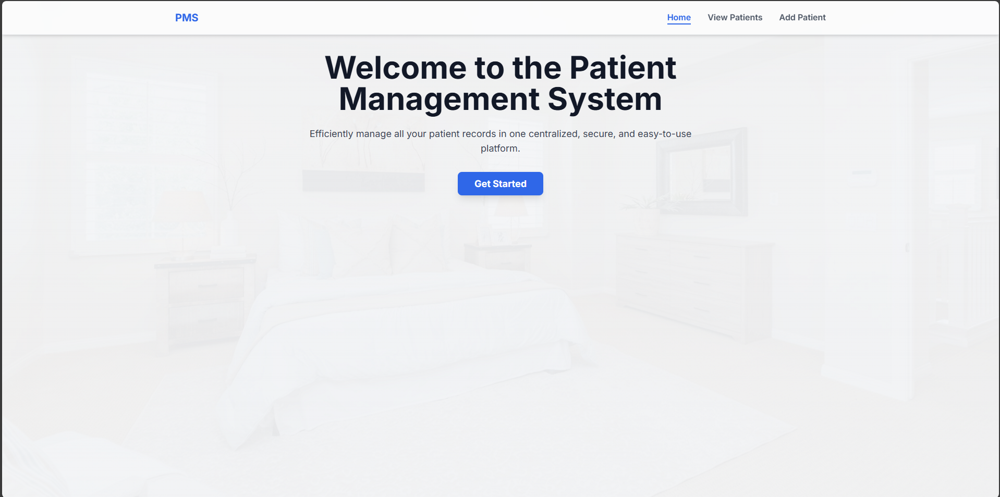

# 🏥 Patient Management System (PMS)

A full-stack web application for managing patient records, built with FastAPI and a modern vanilla JavaScript frontend. This system provides a clean, intuitive interface for creating, viewing, updating, deleting, and sorting patient data.


---

## ✨ Features

* **Full CRUD Functionality:** Create, Read, Update, and Delete patient records seamlessly.
* **Multi-Page Interface:** A professional, multi-page layout for different actions (Home, View, Create, Edit).
* **Dynamic Sorting:** Sort patient records by height, weight, or BMI in ascending or descending order.
* **Computed Fields:** The backend automatically calculates BMI and provides a health verdict (e.g., Normal, Overweight).
* **Data Validation:** Robust backend data validation using Pydantic to ensure data integrity.
* **Modern Frontend:** A responsive and visually appealing user interface built with Tailwind CSS.
* **Interactive UI:** Features like confirmation modals for deletions and notification toasts for user feedback.

---

## 📸 Screenshots

Here's a look at the application in action.

| Home Page                                                                                             | View Patients Page                                                                                               |
| ----------------------------------------------------------------------------------------------------- | ---------------------------------------------------------------------------------------------------------------- |
|                             |                                    |
|   |        |

---

## 🛠️ Tech Stack

This project is built using a combination of modern technologies:

* **Backend:**
    * **Python 3.10+**
    * **FastAPI:** For building the high-performance API.
    * **Pydantic:** For data validation and settings management.
    * **Uvicorn:** As the ASGI server.
* **Frontend:**
    * **HTML5**
    * **CSS3** with **Tailwind CSS:** For rapid, utility-first styling.
    * **Vanilla JavaScript (ES6+):** For all client-side logic and API interactions.

---

## 🚀 Getting Started

Follow these instructions to get a copy of the project up and running on your local machine for development and testing purposes.

### Prerequisites

You need to have Python 3.8+ installed on your system.

### Installation

1.  **Clone the repository:**
    ```bash
    git clone [https://github.com/NaveenGill124/Patient-Management-System.git]
    cd NaveenGill124
    ```

2.  **Create and activate a virtual environment (recommended):**
    * **Windows:**
        ```bash
        python -m venv venv
        .\venv\Scripts\activate
        ```
    * **macOS / Linux:**
        ```bash
        python3 -m venv venv
        source venv/bin/activate
        ```


3.  **Run the application:**
    ```bash
    uvicorn main:app --reload
    ```
    The `--reload` flag makes the server restart after code changes.

4.  **Open your browser:**
    Navigate to `http://127.0.0.1:8000`. You should see the application's home page.

---

## 🔌 API Endpoints

The backend provides the following API endpoints:

| Method | Endpoint             | Description                               |
| :----- | :------------------- | :---------------------------------------- |
| `GET`  | `/view`              | Retrieves all patient records.            |
| `GET`  | `/patient/{id}`      | Retrieves a single patient by their ID.   |
| `GET`  | `/sort`              | Sorts patients by a specified field.      |
| `POST` | `/create`            | Creates a new patient record.             |
| `PUT`  | `/edit/{id}`         | Updates an existing patient's record.     |
| `DELETE`| `/delete/{id}`       | Deletes a patient record by their ID.     |
| `GET`  | `/docs`              | Access the interactive API documentation. |


